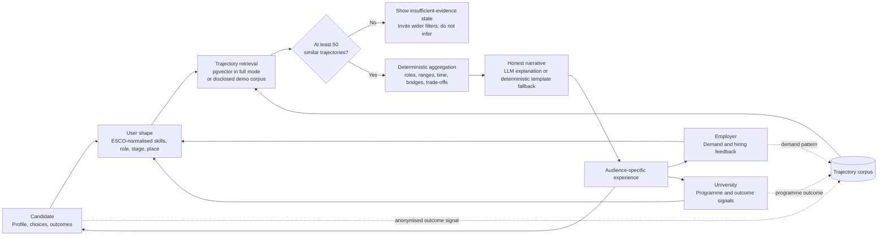

# PathWiser: test evidence and system design

This is the implementation and QA companion to the proposal, Final Kit, OpenAPI contract, and README. It preserves the central product promise: PathWiser shows cohort evidence to support decisions; it does not predict an individual's future.

## What is being delivered

- Candidates explore realistic next-role branches, salary ranges, common skill bridges, trade-offs, and an evidence-grounded coach.
- Employers declare a demand shape, include adjacent talent, and receive an explainable, cohort-backed view rather than keyword-only filtering.
- Universities inspect programme outcomes by horizon and use the outcome signal to inform curriculum priorities.
- All three surfaces call the same Career Twin Engine, so the system is one Career OS rather than three disconnected portals.

## End-to-end flow

## System design

| Layer | Responsibility | Boundary / safeguard |
|---|---|---|
| React / Next.js UI | Role onboarding, interactive dashboards, graph, responsive navigation and feedback | Each account is server-gated to its role; Judge View exists only when explicitly enabled outside production. |
| Typed Next.js routes | Engine, coach, matching, profile, consent, feedback, analytics and health APIs | Zod validates writes and OpenAPI documents the public integration surface. |
| Career Twin Engine | Retrieval -> deterministic aggregation -> explanation | The LLM never creates numeric outcomes; only aggregation supplies them. |
| Data / retrieval | Supabase + pgvector HNSW in full mode; synthetic DOSM-calibrated corpus in demo mode | Demo provenance is disclosed; a cohort below 50 is not aggregated. |
| AI provider | Gemini behind an interface; template fallback | Failed or unavailable narrative generation preserves evidence and stays usable. |
| Security / operations | Supabase Auth/RLS, organisations, revocable consent, rate limits, health, structured telemetry and admin analytics | Full-mode credentials are server-side; local development defaults to the disclosed corpus. |

### Deployment modes

- **Demo / local default:** In-memory, synthetic-but-calibrated corpus. It is deterministic, fast, and does not depend on an external AI service.
- **Community/full mode:** Set `ALLOW_FULL_MODE=true` with valid Supabase and Gemini configuration after migrations and a governed trajectory import. The flag is explicit in every environment.
- **Failure handling:** Production propagates a full-mode retrieval error rather than silently replacing live evidence with synthetic data. Development can fall back to the disclosed demo corpus.

## QA results

| Area | Check | Result |
|---|---|---|
| Engine math and coach honesty | Percentiles, distributions, MyCOL flags, salary ranges, bridges, small-cohort guard, probability totals, predictive-language rejection and deterministic fallback | Pass: 19 automated Vitest tests. |
| Backend API | `POST /api/engine/navigate` with a candidate shape | Pass: 300-person cohort, 13 paths, salary percentiles, bridges and a validated cohort narrative returned. |
| Build quality | TypeScript and Next production compilation | Pass: `npm.cmd run typecheck` and `npm.cmd run build`. |
| Candidate journey | Persona launch -> navigator -> cohort graph -> node detail -> compare mode | Pass in browser; disclosure, salary range, bridges and compare-mode state all rendered. |
| Employer journey | Persona launch -> demand controls -> explainable matching | Pass in browser; local results are explicitly synthetic modelled profiles, while connected mode is restricted to opted-in candidates. No individual prediction score is displayed. |
| University journey | Persona launch -> Outcome Loop -> programme/horizon controls -> CSV export and curriculum handoff | Pass in browser; both actions complete and evidence provenance is visible. |
| Persona access | Direct navigation to another audience while production view is locked | Pass locally and enforced in middleware for authenticated accounts. Cross-audience Judge View requires an explicit environment flag and admin/judge server role. |
| Keyboard and dialogs | Career graph selection with Enter; onboarding exit confirmation | Pass in browser; graph nodes expose names/state and only one modal dialog is presented at a time. |
| Mobile UX | Dashboard at 390 x 844 px | Pass; no horizontal overflow, the closed drawer is absent from the accessibility tree, and one navigation landmark appears when opened. |

## Acceptance criteria for every release

1. `npm.cmd run test`, `npm.cmd run typecheck`, and `npm.cmd run build` pass.
2. `/api/engine/navigate` returns either a validated aggregate with a cohort disclosure or an explicit `cohort_too_small` response; it never returns a fabricated individual prediction.
3. Candidate, employer, and university persona launches reach their designated dashboard without an error state.
4. Candidate graph selection and compare mode work; employer adjacent-talent filtering works; university programme and horizon controls update.
5. Test at 390 px and desktop width: no clipped controls, unreachable actions, or horizontal content loss.
6. Before release, test full-mode Supabase/Gemini connectivity, authentication/RLS policies, rate limits, and any real-data consent/PDPA controls in the target deployment.

## Known delivery boundary

The bundled corpus and candidate profiles are modelled and calibrated to open Malaysian labour anchors. The product now contains an authenticated, consent-gated candidate discovery path, but a public launch still requires applied Supabase migrations, real organisations, a governed trajectory import, PDPA/legal approval, fairness evaluation, monitoring, and production credentials. Until that external work is complete, the interface must retain its modelled-evidence labels.
