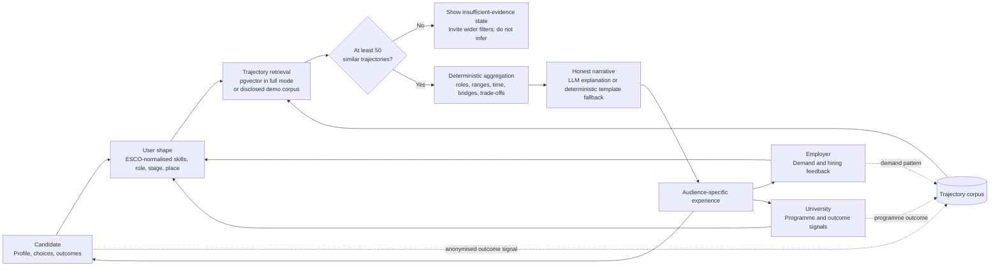

# PathWiser: test evidence and system design

This is the implementation and QA companion to the proposal, Final Kit, OpenAPI contract, and README. It preserves the central product promise: PathWiser shows cohort evidence to support decisions; it does not predict an individual's future.

## What is being delivered

- Candidates explore realistic next-role branches, salary ranges, common skill bridges, trade-offs, and an evidence-grounded coach.
- Employers declare a demand shape, include adjacent talent, and receive an explainable, cohort-backed view rather than keyword-only filtering.
- Universities inspect programme outcomes by horizon and use the outcome signal to inform curriculum priorities.
- All three surfaces call the same Career Twin Engine, so the system is one Career OS rather than three disconnected portals.

## End-to-end flow

## System design

| Layer | Responsibility | Boundary / safeguard |
|---|---|---|
| React / Next.js UI | Role onboarding, interactive dashboards, graph, responsive navigation and feedback | Each account is server-gated to its role; Judge View exists only when explicitly enabled outside production. |
| Typed Next.js routes | Engine, coach, matching, profile, consent, feedback, durable records, marketplace, analytics and health APIs | Zod validates writes, same-origin checks protect mutations, and OpenAPI documents the public integration surface. |
| Career Twin Engine | Retrieval -> deterministic aggregation -> explanation | The LLM never creates numeric outcomes; only aggregation supplies them. |
| Data / retrieval | Supabase + pgvector HNSW in full mode; synthetic DOSM-calibrated corpus in demo mode | Demo provenance is disclosed; a cohort below 50 is not aggregated. |
| AI provider | Gemini behind an interface; template fallback | Failed or unavailable narrative generation preserves evidence and stays usable. |
| Security / operations | Supabase Auth/RLS, organisations, revocable consent, rate limits, health, structured telemetry and admin analytics | Full-mode credentials are server-side; local development defaults to the disclosed corpus. |

### Deployment modes

- **Demo / local default:** In-memory, synthetic-but-calibrated corpus. It is deterministic, fast, and does not depend on an external AI service.
- **Community/full mode:** Set `ALLOW_FULL_MODE=true` with valid Supabase and Gemini configuration after migrations and a governed trajectory import. The flag is explicit in every environment.
- **Failure handling:** Production propagates a full-mode retrieval error rather than silently replacing live evidence with synthetic data. Development can fall back to the disclosed demo corpus.

## QA results

| Area | Check | Result |
|---|---|---|
| Engine math, normalization, ranking, salary presentation and coach honesty | Percentiles, distributions, MyCOL flags, salary ranges, bridges, small-cohort guard, probability totals, taxonomy handling, explainable marketplace ranking, whole-ringgit presentation, predictive-language rejection and deterministic fallback | Pass: 29 automated Vitest tests on 24 July 2026. |
| Production HTTP and API surface | 23 rendered pages; candidate/employer/university engine calls; coach; matching; marketplace; feedback; account isolation; export/deletion safeguards; retention authorization; authentication callback safety; malformed input and Origin handling; security headers | Pass: 44 checks per run. Earlier extended testing completed eight 38-check iterations (304 checks) with zero failures, plus a separate 60-request bounded concurrency pass with 60/60 HTTP 200 responses. |
| Build quality | ESLint, TypeScript, OpenAPI YAML and Next production compilation | Pass: zero-warning ESLint, `npm.cmd run typecheck`, OpenAPI 3.1 parse across 13 paths, and `npm.cmd run build` across all 40 routes. |
| Automated accessibility | WCAG 2.0/2.1/2.2 A and AA semantic rules across public, authentication/recovery, candidate, employer, university, marketplace, feedback and privacy surfaces | Pass: 16 routes and 24 applicable rule groups through `npm.cmd run test:a11y`; rendered browser review covers colour/visual and touch behaviour that JSDOM cannot measure. |
| Dependency security | Entire production and development dependency graph | Pass: Next.js 15.5.21, PostCSS 8.5.22, Sharp 0.35.3 and Vitest 4.1.10; `npm.cmd audit --json` reports zero known vulnerabilities on 24 July 2026. |
| Release metadata | Open Graph/Twitter metadata and 1200 × 630 social image | Pass: metadata tags and `/og-pathwiser.png` return HTTP 200 with the expected PNG content type. |
| Candidate journey | Clean onboarding -> normalization -> launch -> navigator -> cohort graph -> node detail -> compare mode -> coach -> fair-pay -> saved marketplace role | Pass in a fresh production-browser session. The audit removed demo identity leakage, a hard-coded graph role, fractional-ringgit noise and an overconfident comparison claim. |
| Employer journey | Persona launch -> demand controls -> explainable matching -> saved retention review -> onboarding planner | Pass against the labelled modelled-evidence path in a fresh production-browser session; live account persistence remains conditional on the inaccessible production Supabase project. |
| University journey | Persona launch -> outcome horizon -> saved snapshot -> curriculum handoff -> readiness evidence -> contextual reflection | Pass against the labelled modelled-evidence path in a fresh production-browser session; live account persistence remains conditional on the inaccessible production Supabase project. |
| Persona access | Direct navigation to another audience while production view is locked | Enforced in middleware for authenticated accounts. Cross-audience Judge View requires an explicit environment flag and admin/judge server role; production multi-account RLS test remains a launch gate. |
| Keyboard and dialogs | Onboarding close/Escape/focus restoration; marketplace detail Escape; graph selection and compare controls | Pass in the fresh production-browser regression. |
| Rendered route audit | Public page, authentication/recovery and all dashboard pages | Pass: 23 page surfaces rendered with the expected level-one heading and no application/runtime error state. Production persona locking redirected direct cross-audience navigation as designed. |
| Mobile UX | Homepage, onboarding, authentication, candidate navigator, marketplace and privacy surfaces at 390 × 844 px; tablet at 768 × 1024 px | Pass in the rendered in-app browser. The audit replaced an unreadably scaled phone graph with 90 px touch cards, verified a functional 44 × 44 onboarding close target, and retained the full graph from tablet upward. |
| Account privacy lifecycle | Export, consent revocation, erasure confirmation and retention cleanup | Source-complete: portable account JSON excludes embeddings, deletion requires same-origin plus an exact phrase, database erasure cascades account-owned records, and the scheduler endpoint uses a server-only bearer secret. Production multi-account verification remains required. |

## Acceptance criteria for every release

1. `npm.cmd run lint`, `npm.cmd run test`, `npm.cmd run typecheck`, `npm.cmd run build`, `npm.cmd run test:smoke`, `npm.cmd run test:a11y`, and `npm.cmd audit --json` pass.
2. `/api/engine/navigate` returns either a validated aggregate with a cohort disclosure or an explicit `cohort_too_small` response; it never returns a fabricated individual prediction.
3. Candidate, employer, and university persona launches reach their designated dashboard without an error state.
4. Candidate graph selection and compare mode work; employer adjacent-talent filtering works; university programme and horizon controls update.
5. Test at 390 px and desktop width: no clipped controls, unreachable actions, or horizontal content loss.
6. Before release, test full-mode Supabase/Gemini connectivity, authentication/RLS policies, rate limits, and any real-data consent/PDPA controls in the target deployment.

## Known delivery boundary

The bundled corpus and candidate profiles are modelled and calibrated to open Malaysian labour anchors. The configured Supabase endpoint is reachable but currently rejects table access, so full mode remains disabled. A public community launch still requires corrected project access, all four migrations, real organisations, a governed trajectory import, PDPA/legal approval, fairness evaluation, distributed monitoring/rate limiting, backups and production credentials. Until those external gates pass, the interface must retain its modelled-evidence labels and must not be represented as the real-data community release.
