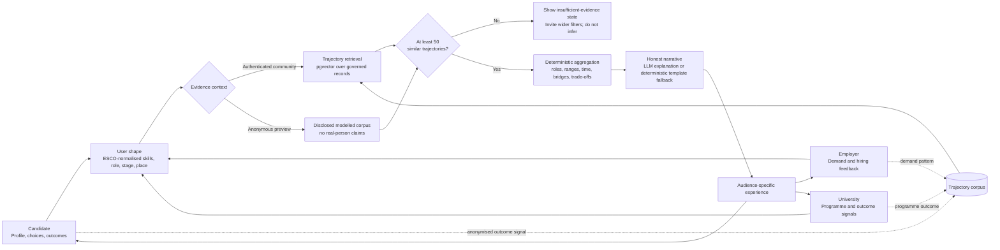

# PathWiser: test evidence and system design

This is the implementation and QA companion to the proposal, Final Kit, OpenAPI contract, and README. It preserves the central product promise: PathWiser shows cohort evidence to support decisions; it does not predict an individual's future.

## What is being delivered

- Candidates explore realistic next-role branches, salary ranges, common skill bridges, trade-offs, and an evidence-grounded coach.
- Employers declare a demand shape, include adjacent talent, and receive an explainable, cohort-backed view rather than keyword-only filtering.
- Universities inspect programme outcomes by horizon and use the outcome signal to inform curriculum priorities.
- The six remaining Final Kit challenge modules are implemented as interactive, durable workflow surfaces: Living Portfolio, Life Chapter Designer, Talent Re-Engagement, Workforce Resilience Planner, Live Internship Marketplace, and Lifelong Learning Wallet.
- All three surfaces call the same Career Twin Engine, so the system is one Career OS rather than three disconnected portals.

## End-to-end flow

```mermaid
flowchart LR
  C[Candidate\nProfile, choices, outcomes] --> S[User shape\nESCO-normalised skills, role, stage, place]
  E[Employer\nDemand and hiring feedback] --> S
  U[University\nProgramme and outcome signals] --> S

  S --> M{Evidence context}
  M -- Authenticated community --> R[Trajectory retrieval\npgvector over governed records]
  M -- Anonymous preview --> P[Disclosed modelled corpus\nno real-person claims]
  P --> G
  R --> G{At least 50\nsimilar trajectories?}
  G -- No --> H[Show insufficient-evidence state\nInvite wider filters; do not infer]
  G -- Yes --> A[Deterministic aggregation\nroles, ranges, time, bridges, trade-offs]
  A --> V[Honest narrative\nLLM explanation or deterministic template fallback]
  V --> X[Audience-specific experience]
  X --> C
  X --> E
  X --> U

  C -. anonymised outcome signal .-> D[(Trajectory corpus)]
  E -. demand pattern .-> D
  U -. programme outcome .-> D
  D --> R
```

## System design

| Layer | Responsibility | Boundary / safeguard |
|---|---|---|
| React / Next.js UI | Role onboarding, interactive dashboards, graph, responsive navigation and feedback | Each account is server-gated to its role; Judge View exists only when explicitly enabled outside production. |
| Typed Next.js routes | Engine, coach, matching, profile, consent, feedback, durable records, marketplace, analytics and health APIs | Zod validates writes, same-origin checks protect mutations, and OpenAPI documents the public integration surface. |
| Career Twin Engine | Retrieval -> deterministic aggregation -> explanation | The LLM never creates numeric outcomes; only aggregation supplies them. |
| Data / retrieval | Supabase + pgvector HNSW in full mode; synthetic DOSM-calibrated corpus in demo mode | Demo provenance is disclosed; a cohort below 50 is not aggregated. |
| AI provider | Gemini behind an interface; template fallback | Failed or unavailable narrative generation preserves evidence and stays usable. |
| Security / operations | Supabase Auth/RLS, organisations, revocable consent, rate limits, health, structured telemetry and admin analytics | Full-mode credentials are server-side; local development defaults to the disclosed corpus. |

### Deployment modes

- **Modelled preview:** Anonymous and named preview personas use the in-memory, synthetic-but-calibrated corpus. This remains interactive in a full-mode deployment and is always labelled `modelled`.
- **Community/full mode:** Set `ALLOW_FULL_MODE=true` with valid Supabase and Gemini configuration after migrations and a governed trajectory import. The flag is explicit in every environment.
- **Evidence separation:** Authenticated community requests never silently fall back to modelled people. They return an explicit cohort gate or temporary-service state. Preview requests opt into modelled evidence by contract.
- **Failure handling:** Gemini embedding requests use an explicit 768-dimensional contract and bounded transient retries. Provider/database outages return a human-readable retry state without exposing provider errors; narrative generation retains its deterministic template fallback.

## QA results

| Area | Check | Result |
|---|---|---|
| Engine math, normalization, ranking, salary presentation, coach honesty, workspace continuity and module-map integrity | Percentiles, distributions, MyCOL flags, salary ranges, bridges, small-cohort guard, probability totals, taxonomy handling, explainable marketplace ranking, whole-ringgit presentation, predictive-language rejection, transient-provider classification, deterministic fallback, device fallback for the six Final Kit workspace modules, and route/SDG coverage for all fifteen audience modules | Pass: 50 automated Vitest tests on 25 July 2026. |
| Production HTTP and API surface | 29 rendered pages; candidate/employer/university modelled flows; explicit community probe; coach; matching; marketplace; feedback; account isolation; export/deletion safeguards; retention authorization; authentication callback safety; malformed input and Origin handling; security headers | Pass: 51 local production checks per run after the Final Kit expansion. Earlier extended testing completed eight 38-check iterations (304 checks) with zero failures, plus a separate 60-request bounded concurrency pass with 60/60 HTTP 200 responses. |
| Repeatable hard-testing harness | Multi-iteration production smoke and accessibility cycles against any configured `PATHWISER_BASE_URL` | Pass: default local run completed 3 iterations / 6 checks on 25 July 2026. The GitHub Production quality gate now also runs a bounded hardening cycle on every PR; use `HARD_TEST_MINUTES=120` for the requested two-hour soak against the final deployment. |
| Build quality | ESLint, TypeScript, OpenAPI YAML and Next production compilation | Pass: zero-warning ESLint, `npm.cmd run typecheck`, OpenAPI 3.1 parse across 13 paths, and `npm.cmd run build` across the expanded route set. PR #8 passed the clean Linux Production quality gate on 25 July 2026. |
| Automated accessibility | WCAG 2.0/2.1/2.2 A and AA semantic rules across public, authentication/recovery, candidate, employer, university, marketplace, feedback and privacy surfaces | Pass: 22 routes and 24 applicable rule groups through `npm.cmd run test:a11y`; rendered browser review covers colour/visual and touch behaviour that JSDOM cannot measure. |
| Dependency security | Production dependency graph | Pass: Next.js 15.5.21, PostCSS 8.5.22, Sharp 0.35.3 and Vitest 4.1.10; `npm.cmd audit --omit=dev --json` reports zero production vulnerabilities on 25 July 2026. Full dev audit still flags ESLint-era transitive tooling, so a major ESLint/tooling upgrade should be handled separately. |
| Release metadata | Open Graph/Twitter metadata and 1200 × 630 social image | Pass: metadata tags and `/og-pathwiser.png` return HTTP 200 with the expected PNG content type. |
| Candidate journey | Clean onboarding -> normalization -> launch -> navigator -> cohort graph -> node detail -> compare mode -> coach -> fair-pay -> saved marketplace role | Pass in a fresh production-browser session. The audit removed demo identity leakage, a hard-coded graph role, fractional-ringgit noise and an overconfident comparison claim. |
| Employer journey | Persona launch -> demand controls -> explainable matching -> saved retention review -> onboarding planner | Pass against the labelled modelled-evidence path in a fresh production-browser session; live account persistence and consented matching remain conditional on populated production accounts and evidence. |
| University journey | Persona launch -> outcome horizon -> saved snapshot -> curriculum handoff -> readiness evidence -> contextual reflection | Pass against the labelled modelled-evidence path in a fresh production-browser session; live account persistence remains conditional on populated production accounts and programme consent. |
| Persona access | Direct navigation to another audience while production view is locked | Enforced in middleware for authenticated accounts. Cross-audience Judge View requires an explicit environment flag and admin/judge server role; production multi-account RLS test remains a launch gate. |
| Keyboard and dialogs | Onboarding explicit close, mid-flow leave confirmation, marketplace detail Escape, graph selection and compare controls | Pass in the fresh production-browser regression. A second hardening pass on 25 July verified that users can close onboarding at step 0 and can choose either Stay or Yes, leave after starting a profile. |
| Rendered route audit | Public page, authentication/recovery and all dashboard pages | Pass: the six added Final Kit pages rendered through the correct one-click persona launcher at desktop 1440 x 900 and mobile 390 x 844 with no horizontal overflow, no clipped key controls/headings, visible feedback paths and no browser console errors. Production persona locking redirected direct cross-audience navigation as designed. |
| Mobile UX | Homepage, onboarding, authentication, candidate navigator, marketplace and privacy surfaces at 390 × 844 px; tablet at 768 × 1024 px | Pass in the rendered in-app browser. The audit replaced an unreadably scaled phone graph with 90 px touch cards, verified a functional 44 × 44 onboarding close target, and retained the full graph from tablet upward. |
| Production account and RLS isolation | Two temporary confirmed users, own-profile reads, cross-account update, employer membership, employer-only RPC, explicit discovery consent, identifier privacy, immediate revocation, Final Kit workspace record insert/read/isolation, and cleanup | Previous pass: 9/9 against live Supabase on 24 July 2026. The updated suite now includes 12 checks and must be rerun after applying migration `0007`; temporary users, organisation and consent/profile/workspace records are cascade-cleaned and cleanup is verified. |
| Account privacy lifecycle | Export, consent revocation, erasure confirmation and retention cleanup | Live consent/revocation and cascading QA cleanup pass. Portable account JSON excludes embeddings, deletion requires same-origin plus an exact phrase, and the scheduler endpoint uses a server-only bearer secret. Final backup/restore and scheduled-retention operations remain an owner-controlled launch check. |

## Acceptance criteria for every release

1. `npm.cmd run lint`, `npm.cmd run test`, `npm.cmd run typecheck`, `npm.cmd run test:openapi`, `npm.cmd run build`, `npm.cmd run test:smoke`, `npm.cmd run test:a11y`, `npm.cmd run test:hardening`, and `npm.cmd audit --omit=dev --json` pass.
2. `/api/engine/navigate` returns either a validated aggregate with a cohort disclosure or an explicit `cohort_too_small` response; it never returns a fabricated individual prediction.
3. Candidate, employer, and university persona launches reach their designated dashboard without an error state.
4. Candidate graph selection and compare mode work; employer adjacent-talent filtering works; university programme and horizon controls update.
5. Test at 390 px and desktop width: no clipped controls, unreachable actions, or horizontal content loss.
6. Before release, test full-mode Supabase/Gemini connectivity, authentication/RLS policies, rate limits, and any real-data consent/PDPA controls in the target deployment.

## Known delivery boundary

The public preview at `https://path-wiser-sigma.vercel.app` is production-built with the previously applied checksum-recorded migrations and API grants. This branch adds `supabase/migrations/0007_final_kit_workspace_records.sql`; apply it in the configured Supabase environment before relying on account-backed saved records for the six new Final Kit modules. The governed tables are intentionally empty after the temporary RLS test cleanup: no real organisation, marketplace, trajectory or consent records have been invented. Anonymous preview personas therefore use the explicitly requested modelled corpus, while authenticated community retrieval stays cohort-gated. A real-data community launch still requires approved organisations and users, a governed consented trajectory import, PDPA/legal and fairness review, distributed monitoring/rate limiting, backups and support operations. Until those external gates pass, PathWiser must be described as a production preview, not a populated real-data community service.
